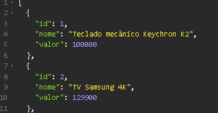
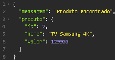
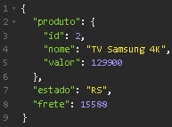

# Programa de Gerenciamento de Produtos

Este é um programa simples para gerenciar informações de produtos, incluindo seus detalhes, preços e cálculo de frete. O programa oferece as seguintes funcionalidades:

- Listagem de todos os produtos disponíveis.
- Consulta de informações de um produto específico por ID.
- Cálculo do frete com base no CEP e no estado de destino.

## Pré-requisitos

Para executar este programa, você precisará ter o Node.js instalado em sua máquina.

## Instalação

1. Clone este repositório para o seu sistema local.
2. Abra o terminal e navegue até a pasta raiz do projeto.
3. Execute o comando `npm install` para instalar todas as dependências necessárias.

## Uso

Para iniciar o servidor, execute o seguinte comando:

```bash
npm start


## Exemplo de Uso

exemplo de  lista com todos os produtos usando a API:



informações de um produto específico por ID:



calculo do frete com base no CEP e estado de destino:

